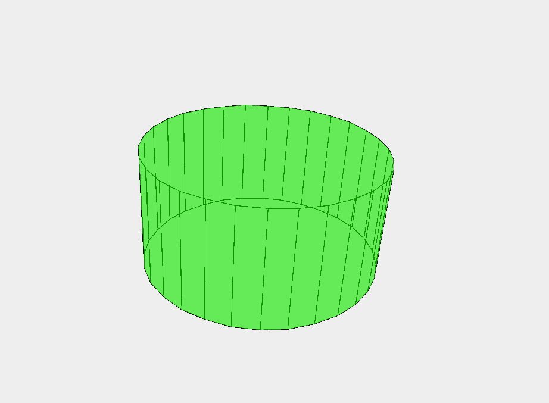

# 3D-Engine-Java
A Basic 3D renderer made entirely in Java.

As a challenging side-project, I attempted to create my own 3D engine with Java and it's built in 2D graphics library.

To create a simple cube, it required me to create a projection function that returns a transformed X and Y when given a Z value. Then, I researched rotational matrices and applied them to my program to rotate them on any axis.

I created other three dimensional shapes with customizable parameters such as heigth, length, and width. One of my more customizable function also takes a value n to create an n-sided polyonal prism. This allowed me to easily create a simple triangular prism or a pentadecagonal prism.
